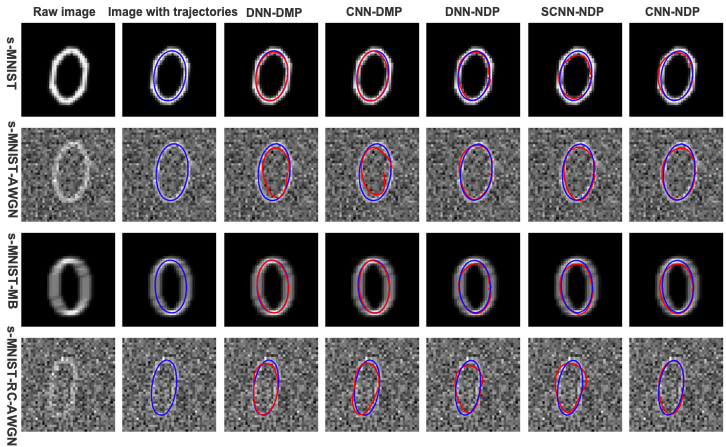
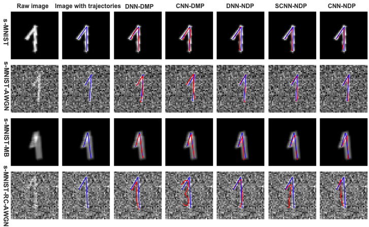

# <center>Towards Robot Skill Learning by Exploiting Imitation Learning</center>
> This repository is for my MSc Project with the degree of MSc Advanced Computer Science(AI).
----
The aim of this project is to investigate and reproduce an imitation learning approach called 
Neural Dynamic Policies(NDPs) proposed by Bahl et al.(2020), which can be found at https://shikharbahl.github.io/neural-dynamic-policies/. 
Meanwhile, we also employ another approach similar to DNPs called Deep Encoder-Decoder Networks proposed by Pahič et al.(2018). Subsequently, 
we improve and build several neural network models and variants based on these two approaches, including DNN-DMP, CNN-DMP, DNN-NDP, SCNN-ND, 
and CNN-NDP. Then, we train, test, evaluate these models on a variety of datasets. Finally, we carry on experiments on a robotic arm to apply NDPs.


## Table of Contents
- **[Architectures](#architectures)**
- **[Installation](#installation)**
- **[Structure of Project](#structure)**
- **[Training Models](#training)**
- **[Project Report](#project)**
  - [Datasets](#datasets)
  - [Designs](#designs)
  - [Implementations](#implementations)
  - [Evaluations](#evaluations)
     - Evaluations on Datasets
     - Experiments on Robotic Arm
- **[Acknowledgements](#acknowledgenment)**


## Architectures <a name="architectures"></a>

**The network architecure of NDPs**
> Given an image of the digit as the input of the deep neural network, the output of deep neural work is the initial DMP 
parameters as the input of a Neural Dynamic Policy (NDP), and NDP will generate parameters w (weights of radial-basis functions) and g (goal for the robot). The parameters of the DMP are then predicted as outputs of the preceding layers in the architecture conditioned on the input. Finally, the 
deep neural network output the motion trajectories using these trained DMPs parameters as the last layer of the deep neural network.
<p float="center", align="center">

</p>

**The network architecure of Deep Encoder-Decoder Neural Networks**
> This architecture describes the process of training DMPs parameters and generating writing 
trajectories of digits. In the first step, each input image is fed to the deep encoder-decoder network that transforms the input image into DMPs parameters, which are compared to raw DMPs parameters associated with the input image. Then, the loss function and its gradients are computed to optimize the parameters of the deep encoder-decoder networks bythe backpropagation algorithm. A deep encoder-decoder model will be trained after the first step. Finally, the DMPs parameters k predicted by the trained model are used to generate the desired writing trajectories associated with this input image by integrating with the DMP approach.
<p float="center", align="center">

</p>
We build our project code based on some open-source code on GitHub.


## Installation <a name="installation"></a>
This code is based on [PyTorch](https://pytorch.org/) libraries. 
Also, we use [Anaconda](https://www.anaconda.com/) to manage our project development environments.If you want to install this project on local machine, please installing `conda` libs before.
To install and setup this code on local machine, running the following commands.
- **clone the repository and config Python environments** 
  ``` 
  # clone this reposotry to a local directory
  git clone https://github.com/linksdl/acs-project-msc_project_codes.git
  
  # cd in this directory
  cd acs-project-msc_project_codes
  
  # create virtual env using conda
  conda create --name env_msc_project_py38 python=3.8
  conda acvtivate env_msc_project_py38
  
  # installing environments
  pip3 install -r requirements.txt
  # or try
  conda env create -f environments.yaml
  ``` 
## Structure of Project <a name="structure"></a>
In this section, we describes the structure of this repository.
- acs-project-msc_project_codes  # folder
    - architectures     # network architecture of models
    - dmp               # implements of Dynamic Movement Primitives (DMPs) 
    - documents         # including some files
    - imednet           # implements of Deep Encoder-Decoder Neural Networks
    - ndp               # implements of NDPs
    - notebooks         # the evaluation results of models on different datasets
    - robot             # experiments on robotic arm 

## Training Models <a name="training"></a>
How to train and test models on local machine, running the following files to train models.
- **train the models on datasets**
  ```
  # train the DNN-DMP model
  train_encoder_decoder.py
  
  # train the CNN-DMP model
  train_cnn_encoder_decoder.py
  
  # train the DNN-NDP model
  train_dnn_ndp.py
  
  # train the SCNN-NDP model
  train_scnn_ndp.py
  
  # train the CNN-NDP model
  train_cnn_ndp.py
  ```


## Project Report <a name="project"></a>

### Datasets <a name="datasets"></a>
In this project, we use five types of datasets to train, test and evaluate our models. they are show as following:
- MNIST dataset: http://yann.lecun.com/exdb/mnist/
- Noisy MNIST (n-MNIST) dataset: https://csc.lsu.edu/~saikat/n-mnist/
- Synthetic MNIST (s-MNIST) dataset: https://portal.ijs.si/nextcloud/s/mnp2DD7qCYzyPd5
- Multi-digit MNIST (m-MNIST) dataset: https://github.com/shaohua0116/MultiDigitMNIST
- EMNIST (e-MNIST) dataset: https://www.nist.gov/itl/products-and-services/emnist-dataset
### Designs <a name="designs"></a>
The designs of DNN-DMP, CNN-DMP, DNN-NDP, SCNN-NDP, and CNN-NDP models shown in `architectures` floder.

### Implementations <a name="implementations"></a>
The implemnetations of our experiments have desrcibed in report in detaild.

### Evaluations  <a name="evaluations"></a>
In this section, we only show some examples of experiments evaluation on s-MNIST datasets. 

#### Evaluations on s-MNIST datasets
We choose the digits(0-9) as the examples from the s-MNIST datasets, and then eveluate the models on these datasets. More exampels of evaluation results in `documents/results/`
> **The examples for digit 0 and 1**
<p float="center", align="center">


</p>


#### Experiments on Robotic Arm
We show some examples of experiments on a robotic arm. In our experiments, we use a robotic arm reproduce trajectories of digits. More examples are shown in  `robot/digits`.
> experiment for digit 0 and 1
<p float="center">


</p>

> experiment for digit 2 and 3
<p float="center">


</p>

> experiment for digit 4 and 5
<p float="center">


</p>

> experiment for digit 6 and 7
<p float="center">


</p>

> experiment for digit 8 and 9
<p float="center">


</p>


## Acknowledgements <a name="acknowledgenment"></a>
In this project, we use some open-source code. The source code of NDPs approach (Neural Dynamic Policies for End-to-End Sensorimotor Learning) is from: https://github.com/shikharbahl/neural-dynamic-policies/. We also use source code of the Deep Encoder-Decoder Networks approach, which comes from: https://github.com/abr-ijs/imednet. Also, some third-party source code comes from: https://github.com/abr-ijs/digit_generator.


## References

Bahl, S., Mukadam, M., Gupta, A. and Pathak, D. 2020. Neural Dynamic Policies for End-to-End Sensorimotor Learning. arXiv:2012.02788.

Pahič, R., Gams, A., Ude, A. and Morimoto, J. 2018. Deep Encoder-Decoder Networks for Mapping Raw Images to Dynamic Movement Primitives In: 2018 IEEE International Conference on Robotics and Automation (ICRA)., pp.5863–5868.

