## Towards Robot Skill Learning by Exploiting Imitation Learning
> This repository is for my MSc Project. 

The aim of this project is to investigate and reproduce an imitation learning approach called 
Neural Dynamic Policies(NDPs) proposed by Bahl et al.(2020), which can be found at https://shikharbahl.github.io/neural-dynamic-policies/. 
Meanwhile, we also employ another approach similar to NDPs called Deep Encoder-Decoder Networks proposed by Pahič et al.(2018). Subsequently, 
we improve and build several deep neural network models and its variants based on these two approaches, namely DNN-DMP, CNN-DMP, DNN-NDP, SCNN-NDP, 
and CNN-NDP. Then, we train, test, and evaluate these models on a variety of datasets. Finally, we carry on some experiments on a robotic arm to apply NDPs. By above process, We can get a investigation results of NDPs.

## Table of Contents
- **[Architectures](#architectures)**
- **[Installation and Usage](#installation)**
- **[Structure of Project](#structure)**
- **[Training of Models](#training)**
- **[Report of Project](#project)**
  - [Datasets](#datasets)
  - [Designs](#designs)
  - [Implementations](#implementations)
  - [Evaluations](#evaluations)
     - [Evaluations on Datasets](#evadatasets)
     - [Experiments on Robotic Arm](#robotic)
- **[Acknowledgements](#acknowledgenment)**

**history of logging**
|Date|Author|Description|Version|Changes|
|----|----|----|----|-----|
|23/08/2021|[linksdl](https://github.com/linksdl)|Instructions|1.0.0|initial instructions|
|25/08/2021|[linksdl](https://github.com/linksdl)|Instructions|1.1.0|add more deatils about the designs and evaluations|

## Architectures <a name="architectures"></a>

**The network architecture of NDPs**
> Given an image of the digit as the input of the deep neural network, the output of deep neural work is the initial DMP 
parameters as the input of a Neural Dynamic Policy (NDP), and NDP will generate parameters w (weights of radial-basis functions) and g (goal for the robot). The parameters of the DMP are then predicted as outputs of the preceding layers in the architecture conditioned on the input. Finally, the 
deep neural network output the motion trajectories using these trained DMPs parameters as the last layer of the deep neural network.
<p float="center", align="center">

</p>

**The network architecture of Deep Encoder-Decoder Neural Networks**
> This architecture describes the process of training DMPs parameters and generating motion 
trajectories of the digits. In the first step, each input image is fed to the deep encoder-decoder network that transforms the input image into DMPs parameters, which are compared to raw DMPs parameters associated with the input image. Then, the loss function and its gradients are computed to optimize the parameters of the deep encoder-decoder networks bythe backpropagation algorithm. A deep encoder-decoder model will be trained after the first step. Finally, the DMPs parameters k predicted by the trained model are used to generate the desired writing trajectories associated with this input image by integrating with the DMP approach.
<p float="center", align="center">

</p>


## Installation and Usage <a name="installation"></a>
We build our project code based on some open-source code on GitHub. This code is based on [PyTorch](https://pytorch.org/). 
Also, we use [Anaconda](https://www.anaconda.com/) to manage our project development environments. If you want to install this project on local machine, please installing `conda` libs before. Finally, some integrated development environment (IDE), such as [Visual Studio Code](https://code.visualstudio.com/), [Pycharm](https://www.jetbrains.com/pycharm/), can install on local meachine to run this project. 
To install and setup this code on a local machine, running the following commands.
- **Clone the repository to local machine** 
  ```sh 
  # clone this reposotry to a local directory
  git clone https://github.com/linksdl/acs-project-msc_project_codes.git
  ```
- **Config the Python Interprater Environments**
 ```sh 
  # cd in this directory
  cd acs-project-msc_project_codes
  
  # create virtual env using conda
  conda create --name env_msc_project_py38 python=3.8
  conda acvtivate env_msc_project_py38
  
  # installing environments
  pip3 install -r requirements.txt
  # or try
  conda env create -f environments.yaml
  ``` 

## Structure of Project <a name="structure"></a>
In this section, we describes the structure of this repository.
- acs-project-msc_project_codes  # folder
    - /architectures     &nbsp;&nbsp;&nbsp;# network architecture of models
    - /dmp               &nbsp;&nbsp;&nbsp;# implements of Dynamic Movement Primitives (DMPs)
      - /utils    
    - /documents         &nbsp;&nbsp;&nbsp;# including some files
      - /examples_datasets
      - /results_experiments
      - designs.rp       &nbsp;&nbsp;&nbsp;#the original prototypes of design using [Axure](https://www.axure.com/)    
    - /imednet           &nbsp;&nbsp;&nbsp;# implements of Deep Encoder-Decoder Neural Networks
      - /data            &nbsp;&nbsp;&nbsp;# datasets used in this project 
        - /m-mnist
        - /mnist
        - /n-mnist
        - /s-mnist
      - /imdednet        &nbsp;&nbsp;&nbsp;# networks 
      - /models          &nbsp;&nbsp;&nbsp;# trained models
      - /scripts         &nbsp;&nbsp;&nbsp;# the python files to start tarining models
    - /ndp               &nbsp;&nbsp;&nbsp;# implements of NDPs
      - /data
      - /mnist_cnn       &nbsp;&nbsp;&nbsp;# MNIST classifiers
      - /ndp_models      &nbsp;&nbsp;&nbsp;# trained models
      - /ndp_nets        &nbsp;&nbsp;&nbsp;# NDPs' models
      - /ndp_train       &nbsp;&nbsp;&nbsp;# the python files to start tarining models 
    - /notebooks         &nbsp;&nbsp;&nbsp;# the evaluation results of models on different datasets
      - /figures
      - /images          &nbsp;&nbsp;&nbsp;# the examples of experiments
    - /robot             &nbsp;&nbsp;&nbsp;# experiments on robotic arm 
      - myrobot.mlx      &nbsp;&nbsp;&nbsp;# MATLAB script to build a robotic arm model
      - trajectory_mnist_test.mat  &nbsp;&nbsp;&nbsp;# the test data   

## Training Models <a name="training"></a>
How to train and test models on local machine, running the following files to train models.
- **Train the models on datasets**
  ```sh
  # train the DNN-DMP model
  python train_encoder_decoder.py
  
  # train the CNN-DMP model
  python train_cnn_encoder_decoder.py
  
  # train the DNN-NDP model
  python train_dnn_ndp.py
  
  # train the SCNN-NDP model
  python train_scnn_ndp.py
  
  # train the CNN-NDP model
  python train_cnn_ndp.py
  ```

## Report of Project <a name="project"></a>

### Datasets <a name="datasets"></a>
In this project, we use five types of datasets to train, test and evaluate our models. they are as following:
- MNIST dataset: http://yann.lecun.com/exdb/mnist/
- Noisy MNIST (n-MNIST) dataset: https://csc.lsu.edu/~saikat/n-mnist/
- Synthetic MNIST (s-MNIST) dataset: https://portal.ijs.si/nextcloud/s/mnp2DD7qCYzyPd5
- Multi-digit MNIST (m-MNIST) dataset: https://github.com/shaohua0116/MultiDigitMNIST
- EMNIST (e-MNIST) dataset: https://www.nist.gov/itl/products-and-services/emnist-dataset
### Designs <a name="designs"></a>
The designs of DNN-DMP, CNN-DMP, DNN-NDP, SCNN-NDP, and CNN-NDP models shown in `architectures` folder.

### Implementations <a name="implementations"></a>
The implementations of our experiments have described in report in detailed.

### Evaluations  <a name="evaluations"></a>
In this section, we only show some examples of experiments evaluation on s-MNIST datasets. 

#### 1，Evaluations on s-MNIST datasets <a name="evadatasets"></a>
We choose the digits(0-9) as the examples from the s-MNIST datasets, and then evaluate the models on these datasets. More examples of evaluation results in `documents/results/`

**The loss values of models on s-MNIST datasets**
> The top-left is evaluation on s-MNIST dataset. The top-rihgt is evaluation on s-MNIST-AWGN dataset. 
> The bottom-left is evaluation on s-MNIST-MB dataset. The bottom-right is evaluation on s-MNIST-RCAWGN dataset.
<p float="center", align="center">
  
  
</p>

<p float="center", align="center">
  
  
</p>

**The examples for digit 0 and 1**
<p float="center", align="center">
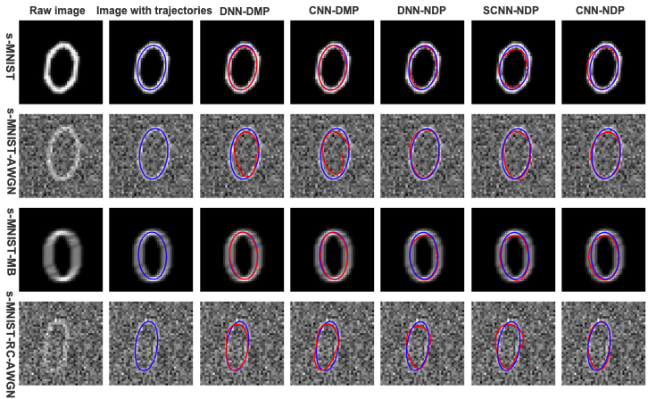
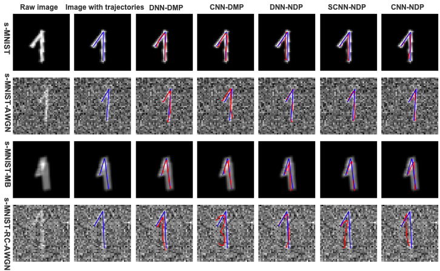
</p>

#### 2，Experiments on Robotic Arm <a name="robotic"></a>
We show some examples of experiments on a robotic arm. In our experiments, we use a robotic arm reproduce trajectories of digits. More examples are shown in  `robot/digits`.
> experiment for digit 0 and 1
<p float="center">


</p>
<p float="center">
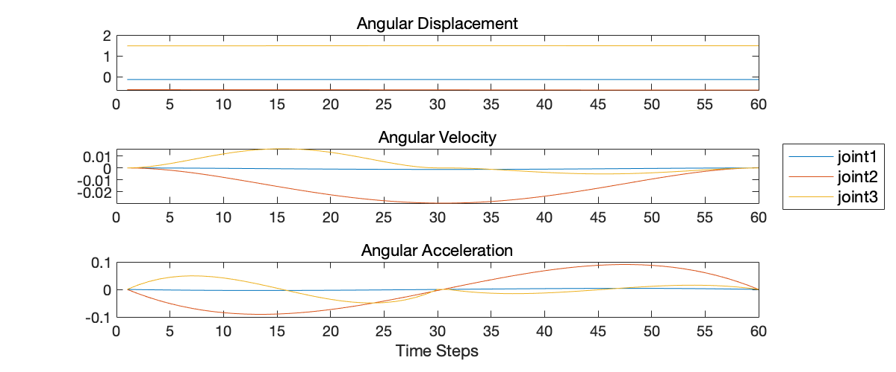
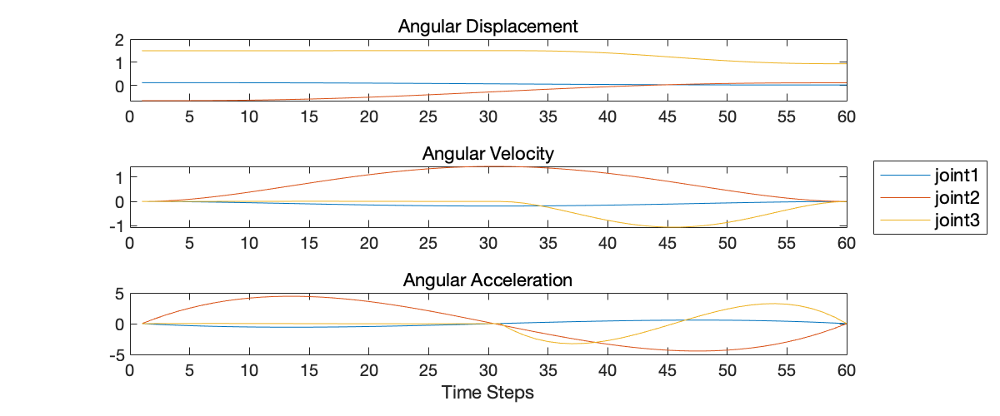
</p>

> experiment for digit 2 and 3
<p float="center">


</p>
<p float="center">
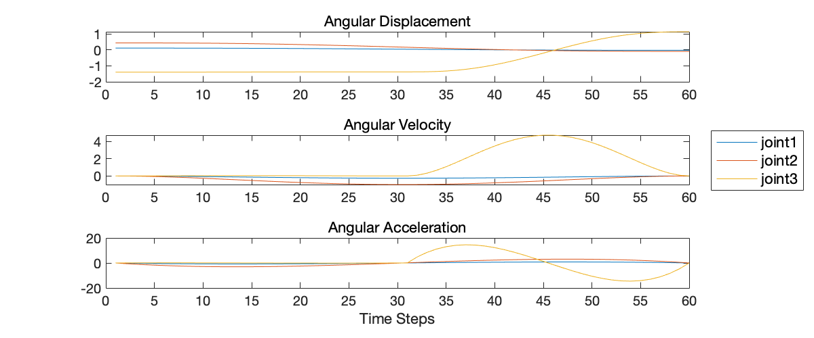
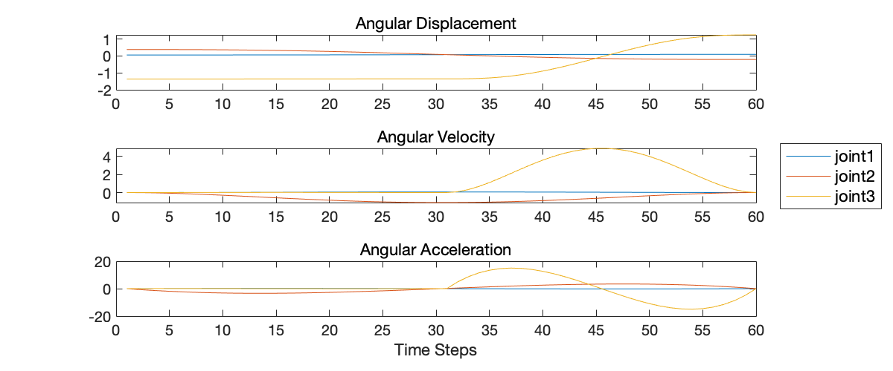
</p>

> experiment for digit 4 and 5
<p float="center">


</p>
<p float="center">
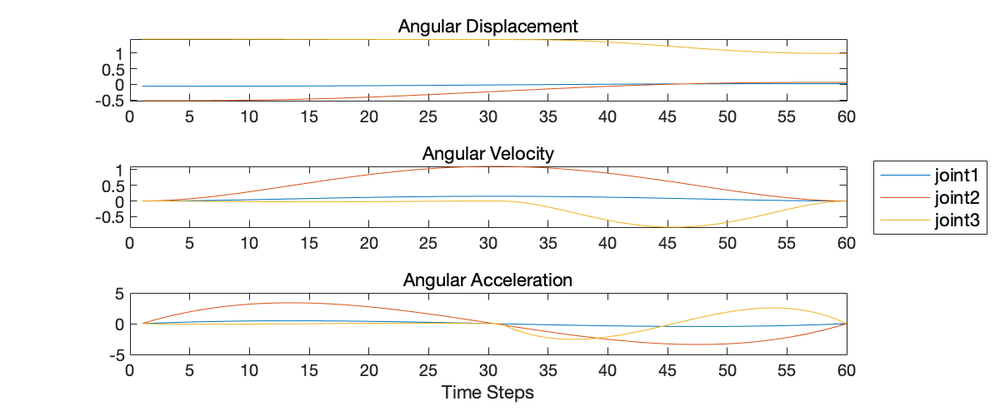
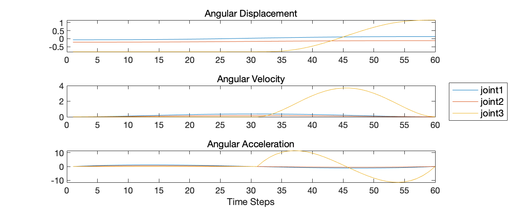
</p>

> experiment for digit 6 and 7
<p float="center">


</p>
<p float="center">
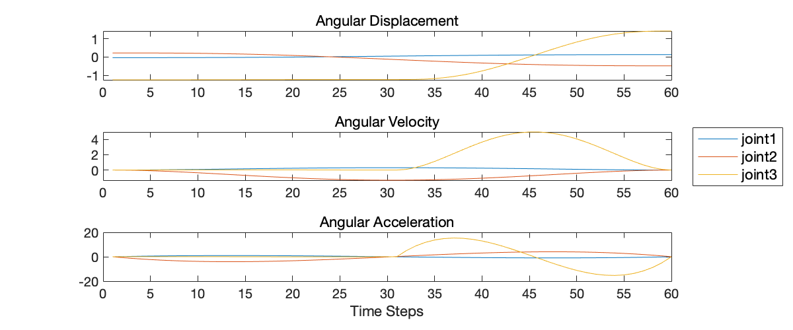
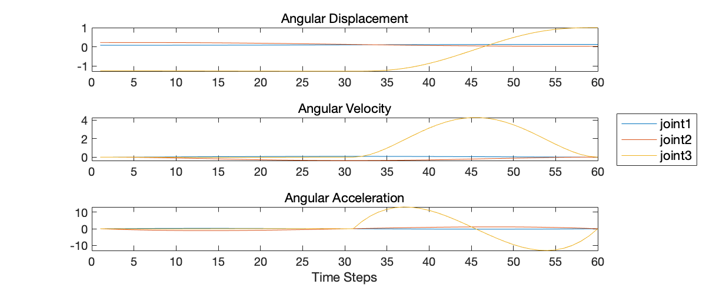
</p>

> experiment for digit 8 and 9
<p float="center">


</p>
<p float="center">
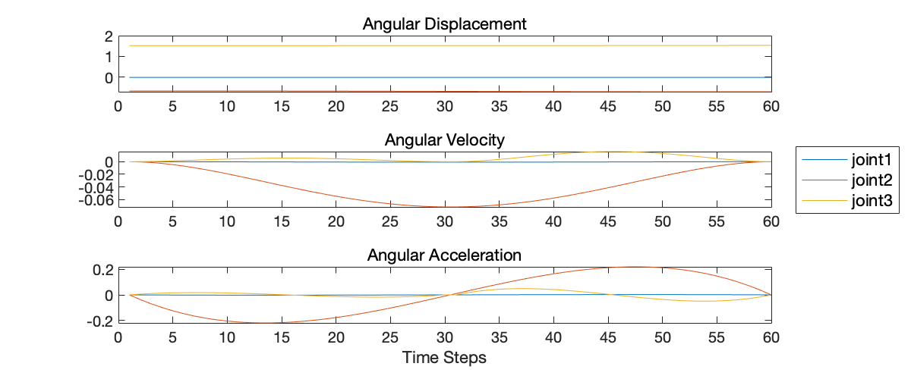
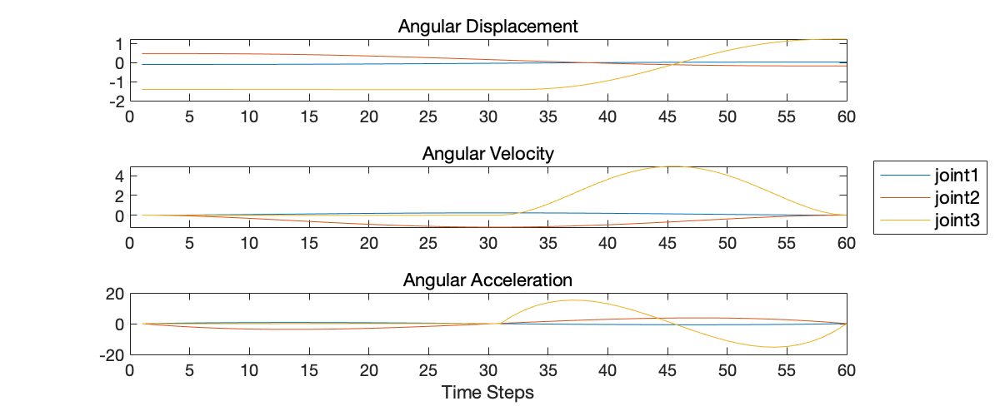
</p>


## Acknowledgements <a name="acknowledgenment"></a>
In this project, we use some open-source code. The source code of NDPs approach (Neural Dynamic Policies for End-to-End Sensorimotor Learning) is from: https://github.com/shikharbahl/neural-dynamic-policies/. We also use open-source code of the Deep Encoder-Decoder Networks approach, which comes from: https://github.com/abr-ijs/imednet. Also, some third-party open-source code comes from: https://github.com/abr-ijs/digit_generator.


## References

Bahl, S., Mukadam, M., Gupta, A. and Pathak, D. 2020. Neural Dynamic Policies for End-to-End Sensorimotor Learning. arXiv:2012.02788.

Pahič, R., Gams, A., Ude, A. and Morimoto, J. 2018. Deep Encoder-Decoder Networks for Mapping Raw Images to Dynamic Movement Primitives In: 2018 IEEE International Conference on Robotics and Automation (ICRA)., pp.5863–5868.

