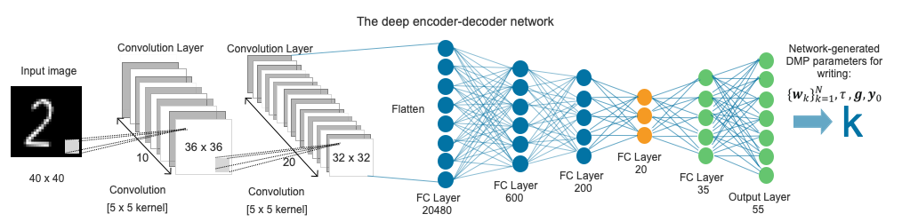

## Towards Robot Skill Learning by Exploiting Imitation Learning
> This repository is for my MSc Project with the degree of MSc Advanced Computer Science(Artificial Intelligence).
----

The aim of this project is to investigate and reproduce an existing approach called Neural Dynamic Policies(NDPs) proposed by Bahl et al.(2020). Besides, we also use another approach called Deep Encoder-Decoder Networks proposed by Pahič et al.(2018) to compare with NDPs. We build five machine learning modela based on these approaches and then train, test, and evaluate on avriety of datasets.


## Table of Contents
- **[1, Installation and Usage](#installation)**
- **[2, Contents of Project](#project)**
  - Datasets
  - Designs of Experiment
  - Implementations of Experiment
  - Evaluation Results
  - Conclusions
- **[3, Acknowledgements](#acknowledgenment)**

## 1, Installation and Usage <a name="installation"></a>
This code is based on [PyTorch](https://pytorch.org/). To install and setup this code in local machine, running the following commands.
- **1: Clone the repository and cd into it** 
  ``` 
  # clone this reposotry to local dir
  git clone https://github.com/linksdl/acs-project-msc_project_codes.git
  
  # cd in this directory
  cd acs-project-msc_project_codes
  
  # create virtual env using conda
  conda create --name env_msc_project_py38 python=3.8
  conda acvtivate env_msc_project_py38
  
  # installing environments
  pip3 install -r requirements.txt
  # or try
  conda env create -f environments.yaml
  ```
  
- **2: Train the models on Datasets**
  ```
  # train the DNN-DMP model
  train_encoder_decoder.py
  
  # train the CNN-DMP model
  train_cnn_encoder_decoder.py
  
  # train the DNN-NDP model
  dnn_ndp_train.py
  
  # train the DNN-NDP model
  train_dnn_ndp.py
  
  # train the SCNN-NDP model
  train_scnn_ndp.py
  
  # train the CNN-NDP model
  train_cnn_ndp.py
  ```

## 2, Contents of Project <a name="project"></a>

### 2.1 Datasets
In this project, we use five types of datasets to train, test and evaluate our models. they are show as following:
- MNIST dataset: http://yann.lecun.com/exdb/mnist/
- Noisy MNIST (n-MNIST) dataset: https://csc.lsu.edu/~saikat/n-mnist/
- Synthetic MNIST (s-MNIST) dataset: https://portal.ijs.si/nextcloud/s/mnp2DD7qCYzyPd5
- Multi-digit MNIST (m-MNIST) dataset: https://github.com/shaohua0116/MultiDigitMNIST
- EMNIST (e-MNIST) dataset: https://www.nist.gov/itl/products-and-services/emnist-dataset
### 2.2 Designs of Experiment

**The network architecture of the DNN-DMP model**


**The network architecture of the CNN-DMP model**


**The network architecture of the DNN-NDP model**


**The network architecture of the SCNN-NDP model**


**The network architecture of the CNN-NDP model**


### 2.3 Implementations of Experiment

#### Experiment on Robot Arm
> experiment for digit 0 and 1
<p float="center">


</p>

> experiment for digit 2 and 3
<p float="center">


</p>

> experiment for digit 4 and 5
<p float="center">


</p>

> experiment for digit 6 and 7
<p float="center">


</p>

> experiment for digit 8 and 9
<p float="center">


</p>


### 2.4 Evaluation Results

### 2.5 Conclusions

## 3, Acknowledgements <a name="acknowledgenment"></a>
In this project, we use some open souce code. The source code of NDPs approach (Neural Dynamic Policies for End-to-End Sensorimotor Learning) is from: https://github.com/shikharbahl/neural-dynamic-policies/. We also use source code of the Deep Encoder-Decoder Networks approach, which comes from: https://github.com/abr-ijs/imednet. Also, some third-party source code comes from: https://github.com/abr-ijs/digit_generator.


## References

Bahl, S., Mukadam, M., Gupta, A. and Pathak, D. 2020. Neural Dynamic Policies for End-to-End Sensorimotor Learning. arXiv:2012.02788.

Pahič, R., Gams, A., Ude, A. and Morimoto, J. 2018. Deep Encoder-Decoder Networks for Mapping Raw Images to Dynamic Movement Primitives In: 2018 IEEE International Conference on Robotics and Automation (ICRA)., pp.5863–5868.

